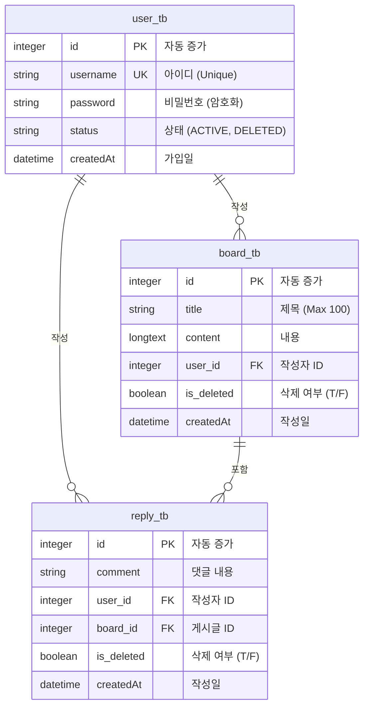

# ERD (Entity Relationship Diagram)

```mermaid
erDiagram
    user_tb ||--o{ board_tb : "작성"
    user_tb ||--o{ reply_tb : "작성"
    board_tb ||--o{ reply_tb : "포함"

    user_tb {
        integer id PK "자동 증가"
        string username UK "아이디 (Unique)"
        string password "비밀번호 (암호화)"
        string status "상태 (ACTIVE, DELETED)"
        datetime createdAt "가입일"
    }

    board_tb {
        integer id PK "자동 증가"
        string title "제목 (Max 100)"
        longtext content "내용"
        integer user_id FK "작성자 ID"
        boolean is_deleted "삭제 여부 (T/F)"
        datetime createdAt "작성일"
    }

    reply_tb {
        integer id PK "자동 증가"
        string comment "댓글 내용"
        integer user_id FK "작성자 ID"
        integer board_id FK "게시글 ID"
        boolean is_deleted "삭제 여부 (T/F)"
        datetime createdAt "작성일"
    }
```
